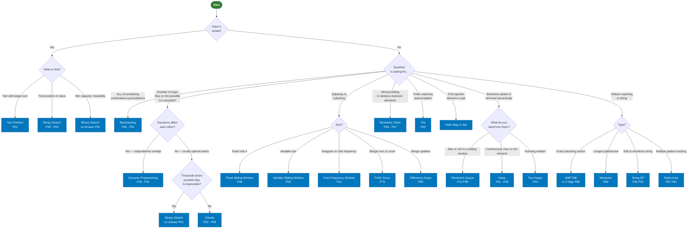
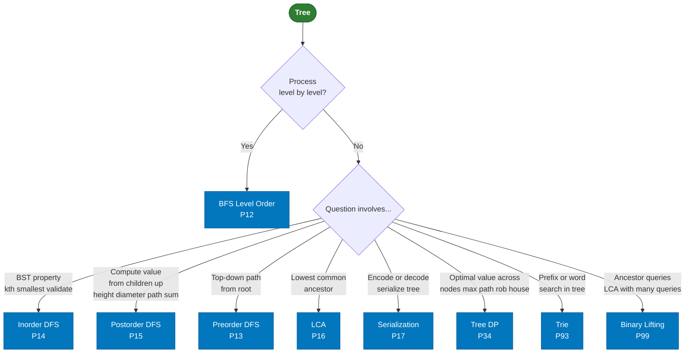
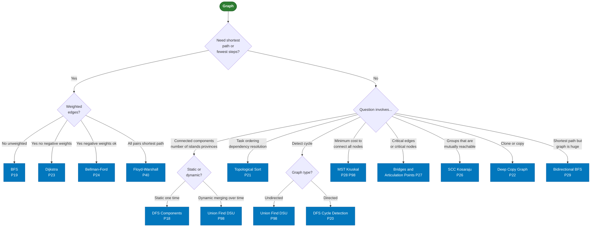
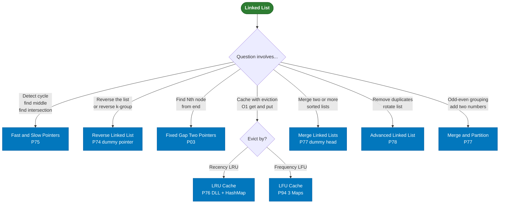
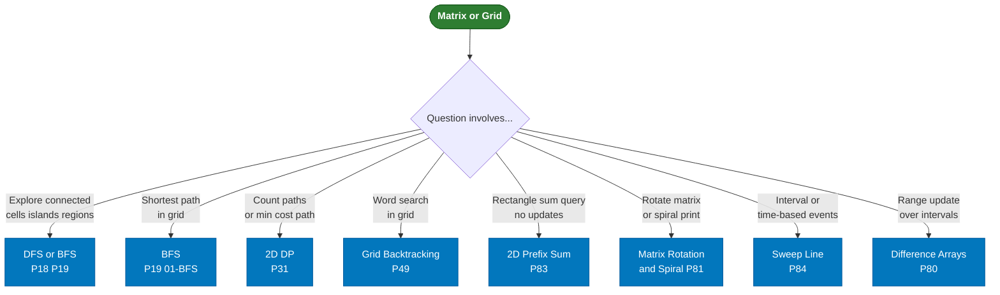
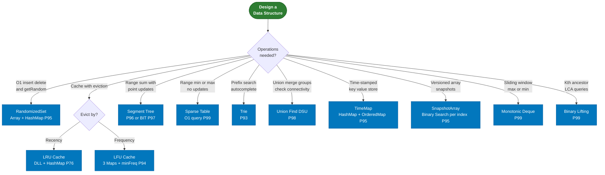

# DSA Pattern Decision Tree

**How to use:** Start at the green node. Follow arrows based on your input type and what the problem asks. Land on the blue box — that's your pattern.

---

## Part 1 — Input is an Array or String



---

## Part 2 — Input is a Tree



---

## Part 3 — Input is a Graph



---

## Part 4 — Input is a Linked List



---

## Part 5 — Input is a Matrix or Grid



---

## Part 6 — Design Problems



---

## Quick-Scan Summary

```
Input Type        → First Question                  → Pattern
─────────────────────────────────────────────────────────────────
Array (sorted)    → find pair/position              → Two Pointers / Binary Search
Array (unsorted)  → all combos?                     → Backtracking
                  → optimal value?                  → DP or Greedy
                  → subarray condition?             → Sliding Window / Prefix Sum
                  → elements added dynamically?     → Heap / Monotonic Queue
String            → pattern match?                  → KMP / Z / Rabin-Karp
                  → palindrome?                     → Manacher / Expand Center
                  → prefix / autocomplete?          → Trie
                  → edit / transform?               → String DP
Tree              → level by level?                 → BFS Level Order
                  → BST property?                   → Inorder DFS
                  → bottom-up compute?              → Postorder DFS
                  → common ancestor?                → LCA
Graph             → shortest path unweighted?       → BFS
                  → shortest path weighted?         → Dijkstra / Bellman-Ford
                  → components / grouping?          → DFS / Union Find DSU
                  → task ordering?                  → Topological Sort
                  → minimum spanning tree?          → Kruskal + DSU
Linked List       → cycle / middle?                 → Fast & Slow Pointers
                  → reverse?                        → Reverse LL
                  → cache?                          → LRU / LFU
Matrix/Grid       → explore regions?               → DFS / BFS
                  → count paths?                    → 2D DP
                  → rectangle sum?                  → 2D Prefix Sum
Design            → O(1) all ops?                   → HashMap + Array/DLL
                  → range queries + updates?        → Segment Tree / BIT
                  → prefix / word search?           → Trie
                  → group merging?                  → Union Find DSU
```
