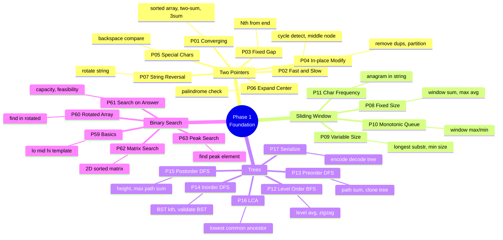
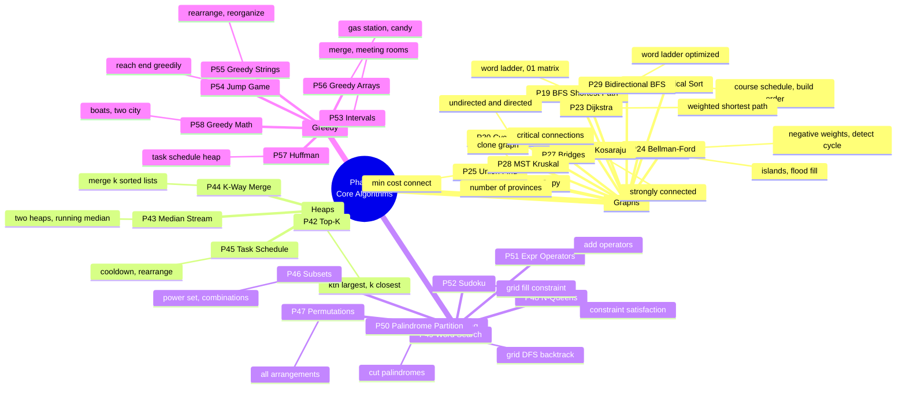
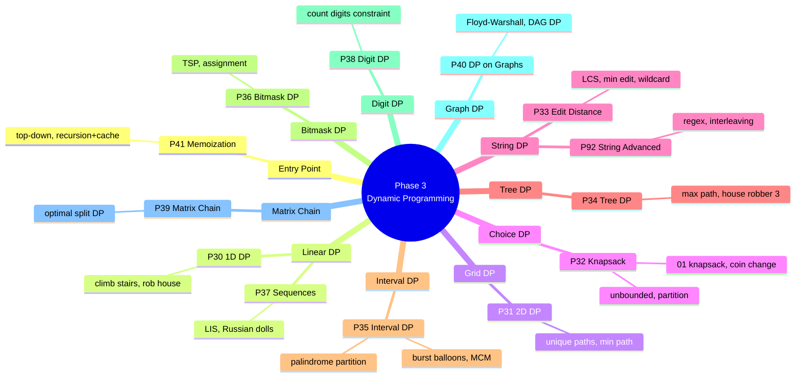
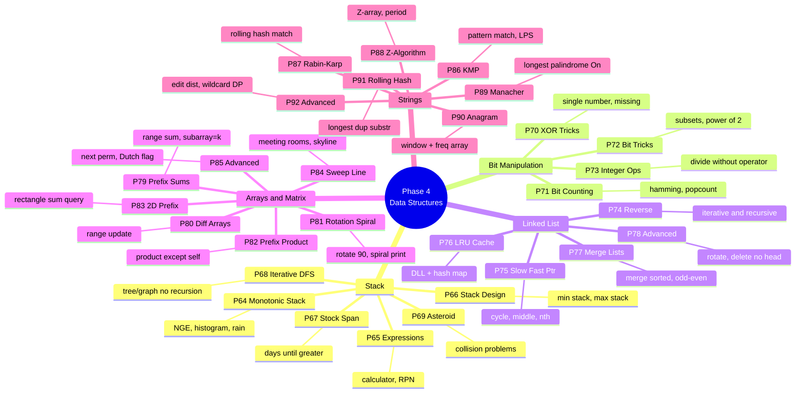
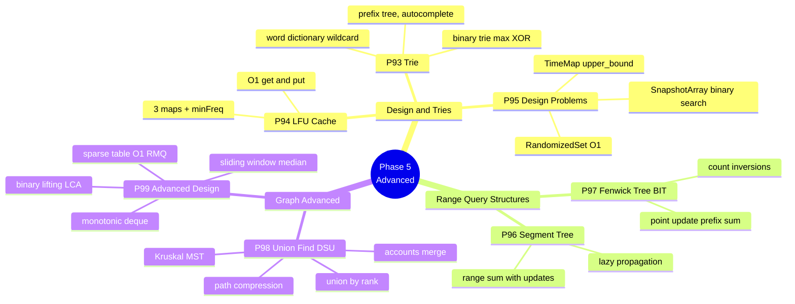
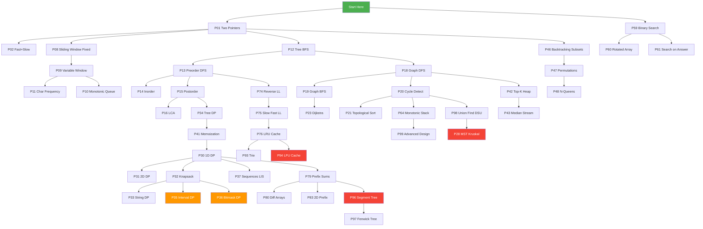

# DSA Patterns — Visual Mindmap & Quick Reference

> **How to use:** Scan the mindmaps to locate your pattern. Use the Decision Tree when you know the problem type but not the pattern. Use the Trigger Table when you have a keyword.

---

## Phase 1 — Foundation



---

## Phase 2 — Core Algorithms



---

## Phase 3 — Dynamic Programming



---

## Phase 4 — Data Structures



---

## Phase 5 — Advanced



---

## Learning Dependency Flowchart



---

## Decision Tree — What Pattern Do I Use?

```mermaid
flowchart TD
    START([Problem Type?]) --> Q1{Sorted array\nor sequence?}
    START --> Q2{Tree or Graph?}
    START --> Q3{Optimal value\nor count?}
    START --> Q4{String matching\nor manipulation?}
    START --> Q5{Design a\ndata structure?}

    Q1 -->|Yes + two indices| P01[Two Pointers P01-07]
    Q1 -->|Yes + subarray/window| P08[Sliding Window P08-11]
    Q1 -->|Yes + find position| P59[Binary Search P59-63]

    Q2 -->|Tree traversal| T1{Need level by level?}
    T1 -->|Yes| P12[BFS Level Order P12]
    T1 -->|No, path/value| P15[DFS Postorder P15]
    T1 -->|BST property| P14[Inorder P14]

    Q2 -->|Graph| G1{Weighted?}
    G1 -->|No| G2{Shortest path?}
    G2 -->|Yes| P19[BFS P19]
    G2 -->|No, components| P18[DFS P18]
    G1 -->|Yes, no neg| P23[Dijkstra P23]
    G1 -->|Yes, neg ok| P24[Bellman-Ford P24]

    Q3 -->|Maximize/minimize\nwith choices| DP1{Subproblems\noverlap?}
    DP1 -->|1D states| P30[1D DP P30]
    DP1 -->|2D grid| P31[2D DP P31]
    DP1 -->|Include/exclude items| P32[Knapsack P32]
    DP1 -->|On string pair| P33[String DP P33]
    DP1 -->|On interval l..r| P35[Interval DP P35]

    Q3 -->|Greedy works?| GR1{Intervals?}
    GR1 -->|Yes| P53[Interval Sched P53]
    GR1 -->|No| P56[Greedy P54-58]

    Q4 -->|Find pattern in text| P86[KMP P86 / Z P88]
    Q4 -->|Longest palindrome| P89[Manacher P89]
    Q4 -->|Anagram/frequency| P90[Anagram P90]
    Q4 -->|Edit/transform| P33[String DP P33]
    Q4 -->|Prefix/autocomplete| P93[Trie P93]

    Q5 -->|Cache eviction| DS1{By recency?}
    DS1 -->|LRU| P76[LRU Cache P76]
    DS1 -->|LFU| P94[LFU Cache P94]
    Q5 -->|Range queries| DS2{Updates needed?}
    DS2 -->|Yes| P96[Segment Tree P96]
    DS2 -->|No| P99[Sparse Table P99]
    Q5 -->|Connected groups| P98[Union Find P98]
    Q5 -->|O1 insert+delete+random| P95[RandomizedSet P95]
```



---

## Quick Trigger Table

| If the problem says... | Use this pattern |
|------------------------|-----------------|
| sorted array, find pair with sum X | P01 Converging Two Pointers |
| linked list cycle, middle node | P02 Fast & Slow Pointers |
| longest/shortest subarray with condition | P09 Variable Sliding Window |
| max/min in sliding window of size k | P10 Monotonic Queue |
| all anagrams in string | P11 Character Frequency |
| level order, right side view, zigzag | P12 Level Order BFS |
| path sum, max path, diameter | P15 Postorder DFS |
| validate BST, kth smallest in BST | P14 Inorder DFS |
| lowest common ancestor | P16 LCA |
| number of islands, connected components | P18 DFS / P98 DSU |
| shortest path unweighted | P19 BFS |
| course schedule, build order | P21 Topological Sort |
| shortest path weighted, no negatives | P23 Dijkstra |
| minimum spanning tree | P28 Kruskal + P98 DSU |
| kth largest in stream | P42 Top-K Heap |
| median of stream | P43 Two Heaps |
| merge k sorted lists | P44 K-Way Merge |
| all subsets, combinations, power set | P46 Backtracking Subsets |
| all permutations | P47 Permutations |
| word search in grid | P49 Grid Backtracking |
| merge intervals, meeting rooms | P53 Interval Scheduling |
| can reach end of array | P54 Jump Game |
| minimum coins, climbing stairs | P30 1D DP |
| unique paths, min path in grid | P31 2D DP |
| 0/1 knapsack, partition equal subset | P32 Knapsack DP |
| edit distance, LCS, longest common | P33 String DP |
| burst balloons, matrix chain multiply | P35 Interval DP |
| TSP, assignment with bitmask | P36 Bitmask DP |
| longest increasing subsequence | P37 LIS DP |
| next greater element, temperatures | P64 Monotonic Stack |
| calculate expression with brackets | P65 Expression Stack |
| min stack, get minimum in O(1) | P66 Stack Design |
| find duplicate, cycle in array | P02 Fast/Slow OR P85 Floyd |
| range sum query, no updates | P79 Prefix Sums |
| range update, sum later | P80 Difference Arrays |
| product of array except self | P82 Prefix Product |
| rectangle sum query 2D | P83 2D Prefix Sum |
| find pattern in string (fast) | P86 KMP |
| longest palindromic substring O(n) | P89 Manacher |
| check if anagram, group anagrams | P90 Anagram Detection |
| prefix search, autocomplete | P93 Trie |
| LRU / LFU cache | P76 LRU / P94 LFU |
| range sum with point updates | P96 Segment Tree / P97 BIT |
| union two groups, cycle undirected | P98 Union Find DSU |
| sliding window maximum | P99 Monotonic Deque |
| kth ancestor, LCA in tree | P99 Binary Lifting |
| static range min/max, O(1) query | P99 Sparse Table |

---

## All 99 Patterns — Full Tree

```
DSA Patterns (99 total)
│
├── 01. TWO POINTERS (P01–P07)
│   ├── P01  Converging           → sorted pair sum, 3sum, trapping rain
│   ├── P02  Fast & Slow          → cycle detect, find middle, happy number
│   ├── P03  Fixed Gap            → Nth node from end
│   ├── P04  In-place Modify      → remove duplicates, move zeros
│   ├── P05  Special Characters   → backspace compare
│   ├── P06  Expand from Center   → palindrome check, longest palindrome
│   └── P07  String Reversal      → reverse words, string rotation
│
├── 02. SLIDING WINDOW (P08–P11)
│   ├── P08  Fixed Size           → window sum, max average
│   ├── P09  Variable Size        → longest substr, min window
│   ├── P10  Monotonic Queue      → sliding window max/min
│   └── P11  Char Frequency       → find anagram, permutation in string
│
├── 03. TREES (P12–P17)
│   ├── P12  Level Order BFS      → level avg, right view, zigzag
│   ├── P13  Preorder DFS         → path sum, clone tree, tilt
│   ├── P14  Inorder DFS          → BST validate, kth smallest
│   ├── P15  Postorder DFS        → height, max path sum, diameter
│   ├── P16  LCA                  → lowest common ancestor
│   └── P17  Serialize            → encode/decode tree
│
├── 04. GRAPHS (P18–P29)
│   ├── P18  DFS Components       → islands, provinces, flood fill
│   ├── P19  BFS Shortest Path    → word ladder, 01-matrix
│   ├── P20  Cycle Detection      → directed + undirected
│   ├── P21  Topological Sort     → course schedule, alien dictionary
│   ├── P22  Deep Copy            → clone graph
│   ├── P23  Dijkstra             → weighted shortest, network delay
│   ├── P24  Bellman-Ford         → negative weights, cheapest flights
│   ├── P25  Union Find (graph)   → number of provinces
│   ├── P26  SCC Kosaraju         → strongly connected components
│   ├── P27  Bridges+Artic Pts    → critical connections
│   ├── P28  MST Kruskal          → min cost to connect all
│   └── P29  Bidirectional BFS    → word ladder optimized
│
├── 05. DYNAMIC PROGRAMMING (P30–P41)
│   ├── P30  1D DP                → climb stairs, rob house, fib
│   ├── P31  2D DP                → unique paths, min path grid
│   ├── P32  Knapsack             → 0/1, unbounded, partition equal
│   ├── P33  String DP            → edit distance, LCS, wildcard
│   ├── P34  Tree DP              → max path sum, rob house 3
│   ├── P35  Interval DP          → burst balloons, palindrome part
│   ├── P36  Bitmask DP           → TSP, assignment problem
│   ├── P37  Sequences DP         → LIS, Russian dolls, max envelopes
│   ├── P38  Digit DP             → count numbers with constraint
│   ├── P39  Matrix Chain DP      → optimal split parenthesization
│   ├── P40  DP on Graphs         → Floyd-Warshall, DAG shortest
│   └── P41  Memoization          → top-down recursion + cache
│
├── 06. HEAPS (P42–P45)
│   ├── P42  Top-K Elements       → kth largest, k closest points
│   ├── P43  Median Stream        → two heaps, running median
│   ├── P44  K-Way Merge          → merge k sorted lists/arrays
│   └── P45  Task Scheduling      → CPU cooldown, rearrange string
│
├── 07. BACKTRACKING (P46–P52)
│   ├── P46  Subsets+Combos       → power set, combination sum
│   ├── P47  Permutations         → all permutations, next perm
│   ├── P48  N-Queens             → queen placement, valid configs
│   ├── P49  Word Search          → grid DFS, path backtrack
│   ├── P50  Palindrome Part      → cut string into palindromes
│   ├── P51  Expression Ops       → add operators to hit target
│   └── P52  Sudoku               → grid fill with constraint prop
│
├── 08. GREEDY (P53–P58)
│   ├── P53  Interval Scheduling  → merge intervals, meeting rooms
│   ├── P54  Jump Game            → reach end, min jumps
│   ├── P55  Greedy Strings       → rearrange, reorganize chars
│   ├── P56  Greedy Arrays        → gas station, candy, boats
│   ├── P57  Huffman+Scheduling   → task schedule, min cost
│   └── P58  Greedy Math          → two city, min arrows
│
├── 09. BINARY SEARCH (P59–P63)
│   ├── P59  Basics               → lo/mid/hi template, variations
│   ├── P60  Rotated Array        → search in rotated sorted
│   ├── P61  Search on Answer     → capacity, split array, painters
│   ├── P62  Matrix Search        → 2D sorted, search matrix
│   └── P63  Peak Search          → find peak, mountain array
│
├── 10. STACK (P64–P69)
│   ├── P64  Monotonic Stack      → NGE, histogram, rain water
│   ├── P65  Expression Eval      → calculator, evaluate RPN
│   ├── P66  Stack Design         → min stack, max stack
│   ├── P67  Stock Span           → daily temperatures, span
│   ├── P68  Iterative DFS        → tree traversal without recursion
│   └── P69  Asteroid Collision   → collision/dominance problems
│
├── 11. BIT MANIPULATION (P70–P73)
│   ├── P70  XOR Tricks           → single number, find duplicate
│   ├── P71  Bit Counting         → hamming distance, count bits
│   ├── P72  Bit Tricks           → enumerate subsets, power of 2
│   └── P73  Integer Operations   → divide, multiply via bits
│
├── 12. LINKED LIST (P74–P78)
│   ├── P74  Reverse              → reverse list, reverse k-group
│   ├── P75  Slow+Fast Pointers   → cycle detect, intersection, nth
│   ├── P76  LRU Cache            → doubly linked list + hash map
│   ├── P77  Merge Lists          → merge sorted, odd-even, add nums
│   └── P78  Advanced             → remove dups, rotate, delete node
│
├── 13. ARRAYS & MATRIX (P79–P85)
│   ├── P79  Prefix Sums          → range sum, subarray sum = k
│   ├── P80  Difference Arrays    → range update, car pooling
│   ├── P81  Rotation+Spiral      → rotate 90°, spiral traversal
│   ├── P82  Prefix Product       → product except self
│   ├── P83  2D Prefix Sum        → rectangle sum query
│   ├── P84  Sweep Line           → meeting rooms II, skyline
│   └── P85  Advanced             → Boyer-Moore, Dutch flag, cyclic sort
│
├── 14. STRINGS (P86–P92)
│   ├── P86  KMP                  → pattern match, failure function
│   ├── P87  Rabin-Karp           → rolling hash, multi-pattern
│   ├── P88  Z-Algorithm          → Z-array, string period
│   ├── P89  Manacher             → longest palindrome O(n)
│   ├── P90  Anagram Detection    → sliding freq window
│   ├── P91  Rolling Hash         → longest dup substr, binary search
│   └── P92  Advanced             → edit dist, wildcard, interleave
│
└── 15. DESIGN & ADVANCED (P93–P99)
    ├── P93  Trie                 → prefix tree, word dict, max XOR
    ├── P94  LFU Cache            → 3-map design, O(1) all ops
    ├── P95  Design Problems      → RandomizedSet, TimeMap, Snapshot
    ├── P96  Segment Tree         → range query + point update
    ├── P97  Fenwick Tree (BIT)   → prefix sum with updates
    ├── P98  Union Find (DSU)     → groups, Kruskal, accounts merge
    └── P99  Advanced Design      → deque, sparse table, binary lift
```

---

## Complexity at a Glance

| Pattern Group | Typical Time | Space |
|--------------|-------------|-------|
| Two Pointers | O(n) | O(1) |
| Sliding Window | O(n) | O(k) |
| Binary Search | O(log n) | O(1) |
| Tree DFS/BFS | O(n) | O(h) / O(n) |
| Graph BFS/DFS | O(V+E) | O(V) |
| Dijkstra | O(E log V) | O(V) |
| Top-K Heap | O(n log k) | O(k) |
| Backtracking | O(2ⁿ) or O(n!) | O(n) |
| Greedy | O(n log n) | O(1) |
| 1D/2D DP | O(n) / O(n²) | O(n) / O(n²) |
| Knapsack DP | O(n × W) | O(W) |
| Monotonic Stack | O(n) | O(n) |
| Prefix Sum | O(1) query / O(n) build | O(n) |
| KMP | O(n+m) | O(m) |
| Trie | O(L) per op | O(alphabet × n) |
| Segment Tree | O(log n) query+update | O(n) |
| Fenwick Tree | O(log n) query+update | O(n) |
| Union Find DSU | O(α(n)) ≈ O(1) | O(n) |
| Sparse Table | O(1) query / O(n log n) build | O(n log n) |
